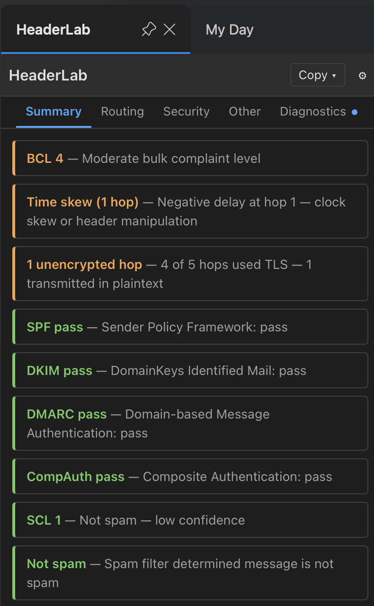

# HeaderLab

[](https://github.com/mgieselman/headerlab/actions/workflows/build.yml)
[](https://github.com/mgieselman/headerlab/actions/workflows/test.yml)
[](https://codecov.io/gh/mgieselman/headerlab)
[](https://nodejs.org/)
[](https://eslint.org/)
[](https://opensource.org/licenses/MIT)

Email header analyzer — parses raw transport headers into human-readable routing, timing, and security analysis. Runs as a standalone web app and as a Microsoft Outlook add-in.

**Live app:** [https://happy-pond-01840f710.4.azurestaticapps.net](https://happy-pond-01840f710.4.azurestaticapps.net)



## Relationship to microsoft/MHA

HeaderLab shares the same original codebase lineage as [microsoft/MHA](https://github.com/microsoft/MHA) — the Message Header Analyzer add-in that has been part of the Microsoft 365 ecosystem for many years.

The divergence was driven by necessity. Modern Microsoft 365 tenants have been retiring Exchange Web Services (EWS) authentication in favor of OAuth 2.0 and Nested App Authentication (NAA). Updating the header retrieval layer to support NAA required changes throughout the auth and retrieval stack. Alongside that, a full UI rebuild was undertaken — replacing the legacy frame-based multi-pane layout with a single-page TypeScript application, adding a proper component model, CSS custom properties for theming, and a Vite-based build pipeline.

The cumulative scope of these changes made merging back into the upstream MHA repository impractical. **HeaderLab is not a GitHub fork of microsoft/MHA** — it is an independently developed tool that grew from the same roots.

## Features

- **Routing analysis** — visualizes the full delivery path with per-hop timing and delay attribution
- **Authentication results** — SPF, DKIM, and DMARC pass/fail with RFC links
- **Antispam verdicts** — parses `X-Forefront-Antispam-Report` and `X-Microsoft-Antispam` headers
- **Rule-based diagnostics** — flags configuration issues and anomalies
- **Outlook add-in** — retrieves headers directly from the selected message via Office.js / NAA
- **Standalone web app** — paste raw headers and analyze without signing in
- **Light / dark / system theme** — persisted to localStorage
- **Copy to clipboard** — export the current view or a plain-text report

## Installing the Outlook Add-in

HeaderLab works as an Outlook add-in for Windows, Mac, and Outlook on the web. Once installed, it appears in the ribbon when you open or select a message and retrieves headers automatically.

Sideload the add-in using the hosted manifest URL — no AppSource listing required.

**Outlook on the web**
1. Open [Outlook on the web](https://outlook.office.com) and select any message
2. Click the **···** overflow menu → **Get Add-ins**
3. Select **My add-ins** → **Add a custom add-in** → **Add from URL**
4. Paste the manifest URL:
   ```
   https://happy-pond-01840f710.4.azurestaticapps.net/manifest.json
   ```
5. Click **OK** and accept the warning — HeaderLab will appear in the ribbon

**Outlook for Windows / Mac**
1. Open Outlook and go to **Home** → **Get Add-ins** (or **Store**)
2. Select **My add-ins** → **Add a custom add-in** → **Add from URL**
3. Paste the same manifest URL above and click **Install**

**Organization-wide deployment (Microsoft 365 admin)**
1. Go to the [Microsoft 365 admin center](https://admin.microsoft.com) → **Settings** → **Integrated apps**
2. Click **Upload custom apps** → **Office Add-in** → **Upload manifest file (.xml or .json)**
3. Upload `manifest.json` from this repo (or point to the URL above)
4. Assign to users or groups and deploy

**Using the add-in**

1. Select or open a message in Outlook
2. Click **HeaderLab** in the ribbon (or the **···** overflow menu on mobile)
3. The add-in opens and displays the routing, security, and diagnostics tabs automatically

### Standalone web app

No installation needed — paste raw headers directly at:

**[https://happy-pond-01840f710.4.azurestaticapps.net](https://happy-pond-01840f710.4.azurestaticapps.net)**

## Quick Start (development)

**Requirements:** Node >= 18.12.0 (CI uses Node 22)

```bash
npm ci            # install dependencies
npm run dev       # dev server at http://localhost:44336
npm test          # lint + all tests
npm run build     # production build → Pages/
```

### Other commands

```bash
npm run lint          # ESLint
npm run lint:fix      # ESLint with auto-fix
npm run test:watch    # Vitest in watch mode
npm run size          # check bundle size budgets
npx vitest run src/Scripts/path/to/file.test.ts  # single test file
```

## Deployment

Deployed to Azure Static Web Apps from `Pages/`. Push to `main` triggers the build and deploy workflow. Secrets required:

| Secret | Purpose |
|--------|---------|
| `AZURE_STATIC_WEB_APPS_API_TOKEN` | Deployment token |
| `HEADERLAB_NAA_CLIENT_ID` | Entra ID app registration for NAA |
| `APPINSIGHTS_INSTRUMENTATIONKEY` | Application Insights (optional) |

## Contributing

See [CONTRIBUTING.md](CONTRIBUTING.md).

## License

MIT — see [LICENSE](LICENSE).

> **Note on copyright:** The MIT license originally carried a Microsoft copyright from the shared MHA codebase lineage. HeaderLab is independently maintained; the copyright has been updated to reflect the current maintainer.
